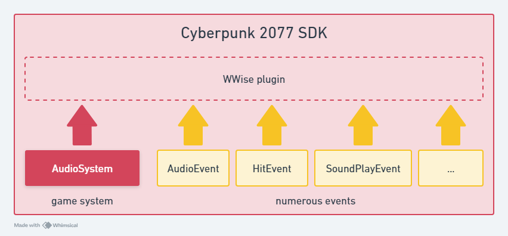
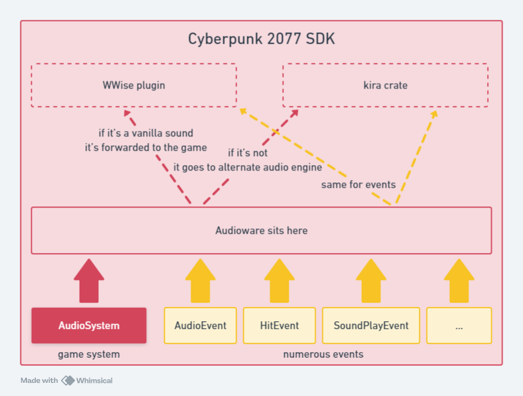

# Concept

Out-of-the-box, Cyberpunk 2077's *vanilla*[^1] audio engine is built on top of [Audiokinetic's WWise](https://www.audiokinetic.com/en/wwise/overview/) which is a professional-grade audio software and tools suite.

Audioware *does not make any use of it* and it has *almost* **no** control over it.

Here's how Cyberpunk 2077 is designed, in an overly simplified way.

~~~admonish question title="Why not directly hook WWise?"
When I initially started working on Audioware I also was tempted to hook everything from Audiokinetic to allow adding custom audio to the game. At first.
~~~

But the reality is that, when you choose this path on one side you get native[^2] integration which is great, but on the other you then need to do everything as both [WWise](https://www.audiokinetic.com/en/library/edge/?source=SDK&id=index.html) and the game does. Not even mentioning that you actually will have to learn how CDPR works with WWise, which is [not always standard](https://github.com/vgmstream/vgmstream/issues/778).

Professional *all-in-one* softwares like Audiokinetic can be dauting to use when unfamiliar and quickly become an entry-skills barrier[^3] for newcomers who would simply like to add sounds, play around with them, have fun and come up with an interesting mod.

~~~admonish question title="What about REDmod?"
I really enjoyed [REDmod](https://wiki.redmodding.org/cyberpunk-2077-modding/for-mod-creators-theory/modding-tools/redmod/audio-modding) in the beginning but always felt frustrated after a while to not be able to alter sounds dynamically.
~~~

The [audio parameters](https://wiki.redmodding.org/cyberpunk-2077-modding/for-mod-creators-theory/modding-tools/redmod/audio-modding#parameters) it exposes are very cool, but as far as I remember you can't seamlessly switch from one to another, and if you want multiple parameters per sound you basically have to duplicate them as many times.

Last but not least, I regularly got players complaining about it becoming overly slow when (too?) many mods use it, and it does not seem particularly appreciated among player base.

~~~admonish question title="Then, how?"
What I always wanted *right from start* is a tool that can get me going in under 15min.

I wanted something to be able to play easily defined sounds with parameters and audio effects.

Something Simple. Easy. yet Customizable and Fast.
~~~

And this how Audioware was initially born as a simple proof-of-concept in [4ddicted](https://github.com/cyb3rpsych0s1s/4ddicted), another mod of mine. Until other modders started to notice that it worked pretty well and asked me to turn into a fully integrated native plugin.

Audioware actually uses a second alternate audio engine named [kira][kira], *alongside* vanilla one.

It then does integrate seamlessly, creating the illusion that there's only one and unique audio environment.

Here is, once again in an overly simplified way, how it works:

---

But let's process to [next chapter](./HOWTO.md) to see how it can be used, and what it can currently do for you.

[^1]: *vanilla* describes everything belonging to the original game, as opposed to further modifications or *mods* made by the community.

[^2]: *natively* in the sense that tool, assets and game itself speaks the exact same language leading to seamless integration.

[^3]: reserved to a handful of professional.

[kira]: https://docs.rs/kira/latest/kira "kira crate"
