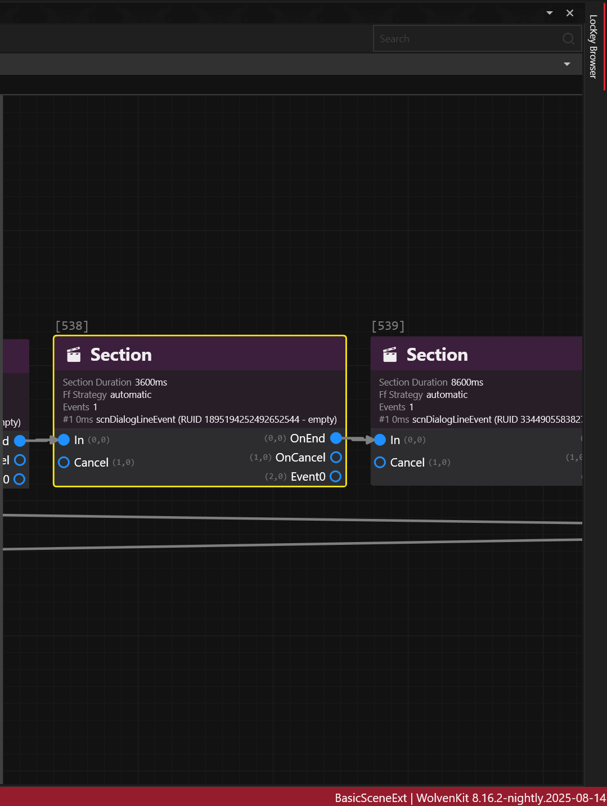
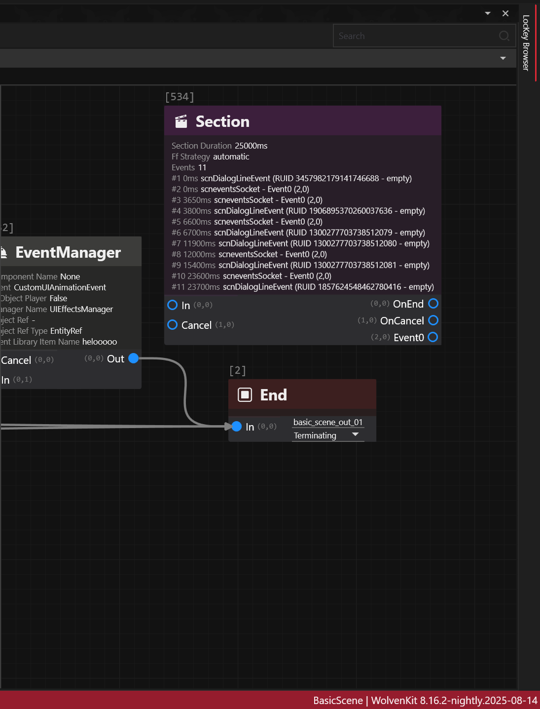
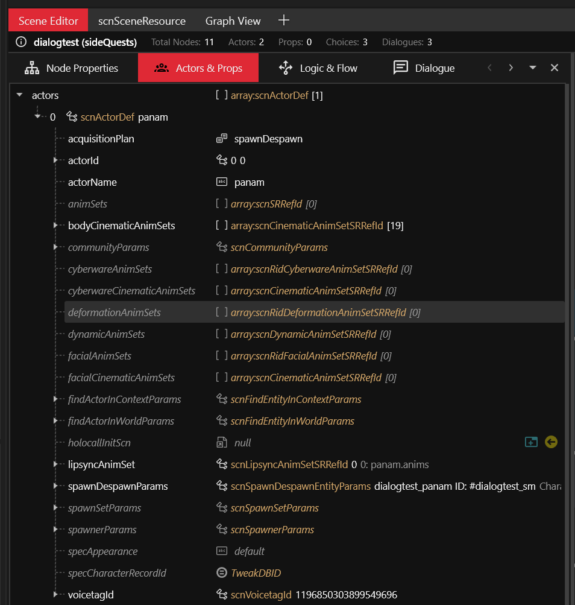
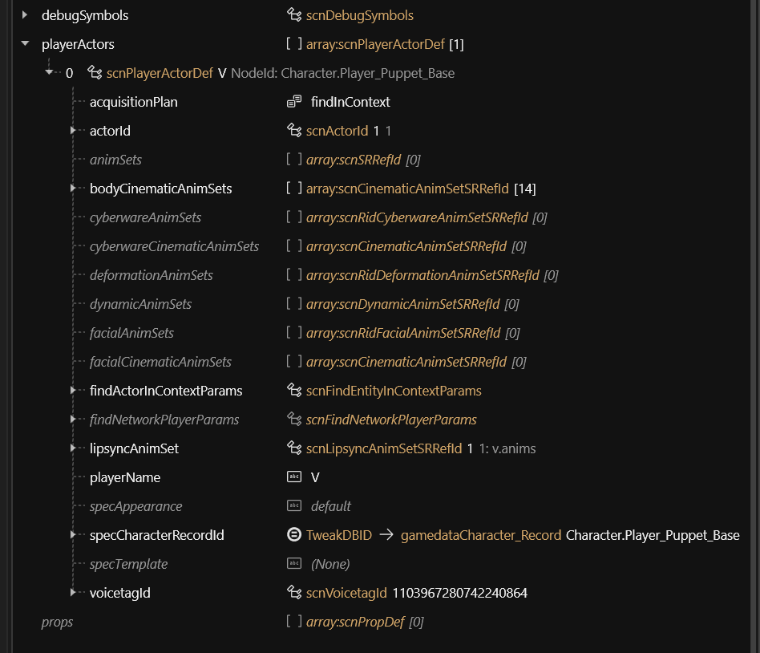
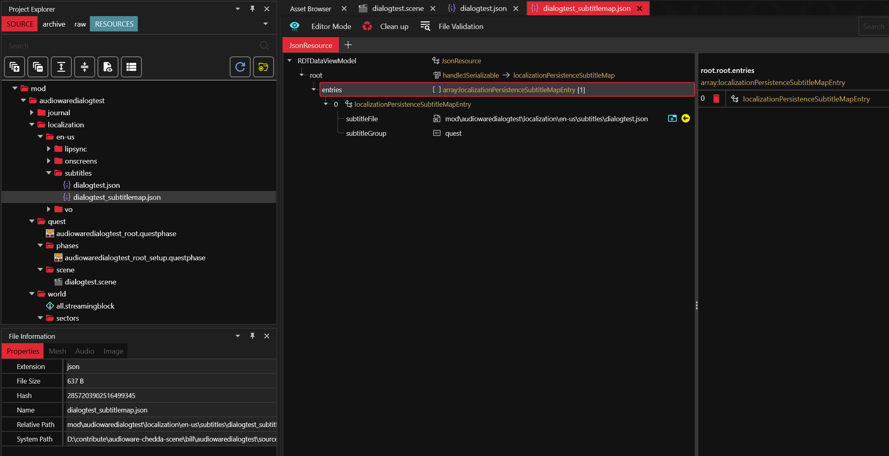
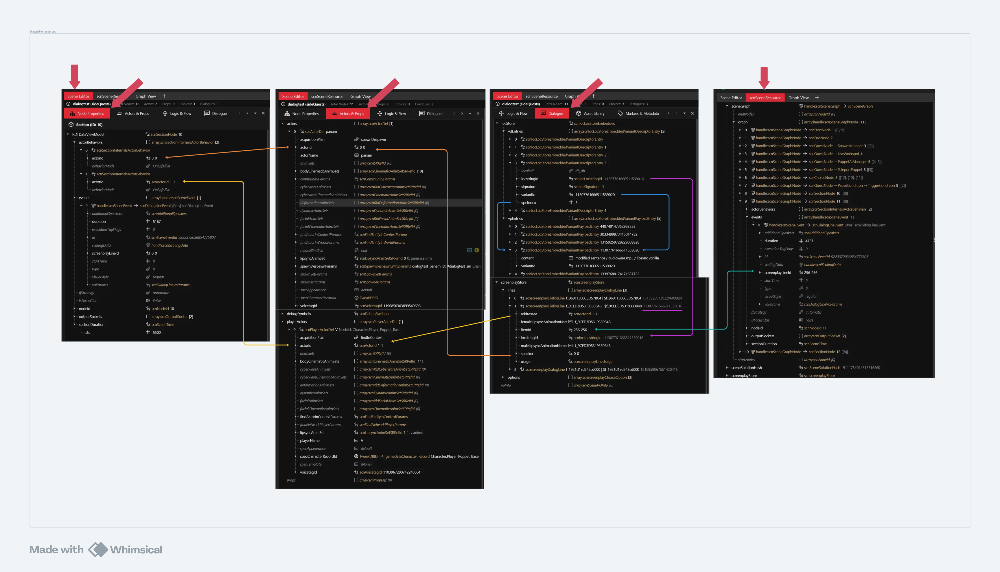

# Scene dialog lines

Audioware allows to use custom audio in Quest Scenes dialog lines, which can be freely mixed with vanilla ones.

## Preambule

A scene a.k.a [scnSceneResource](scnSceneResource) contains multiple nodes a.k.a [scnSectionNode](scnSectionNode) chained together to create a dialogue between V and NPCs and other interactions.

Thanks to WolvenKit Editor you can already visualize Quests, including their Phases and Scenes.

Multiple scene section nodes can contain a dialog line event a.k.a [scnDialogLineEvent](scnDialogLineEvent).



But a single scene section node can also contains multiple successive dialog line events.



This concept applies for discussions over the holocall, during braindances, yet using different scene nodes that won't be covered here.

## Creating a dialogue

This documentation won't go over the basics of `.quest`, `.questphase` and `.scene` as [REDmodding Wiki already does](https://wiki.redmodding.org/cyberpunk-2077-modding/modding-guides/quest).

Aside from nodes, a dialog line itself requires roughly 4 components:

1. a voice actor
1. audio asset(s) for the voice
1. subtitle(s) to display on-screen
1. lipsync animation(s) to be performed by the actor

```admonish info
Implementing the first 3 ones is relatively easy while lipsync requires additional consideration, as developed below.
```

Consider first that, for most of the dialog lines in the game, you probably don't need any lipsync.

```admonish tip
If you think about it one second, most of V's dialogues are made in first-person perspective (fpp).

So unless V stands nearby a reflecting surface, a mirror, or sits inside a car (where third-person perspective or tpp, can be activated) you probably don't need to worry about lipsync.

For a large portion of NPCs it's gonna be the same: devices, drones, droids, cyborgs and mechs do not have lips.

Scavs with digital masks, humanoids with clothing or cyberware covering their lips also fall into this category.
```

Since the topic is hairy, a [sample example .scene is provided in the repo](../../examples/scenes),
on which the following documentation is directly based so that you can follow along.

## Actor

In order to voice a dialogue you must first define the actors.

At a minimum, there's a `speaker` (the one who talks), and an `addressee` (the one being talked to).

The [actors](actors) field in the [scnSceneResource](scnSceneResource) defines all the actor(s), except for the player's actor(s).



The player's actor(s) can be found under [playerActors](playerActors).



## Voice

For example, here's how adding a custom dialog line audio for Panam in Audioware looks like:

```yml
# resources\r6\audioware\dialogtest\dialogs.yaml
version: 1.0.0
dialogs:
  13159259729229609924:
    en-us: ./en-us/vo/panam_f_b69f1500c3d57bc4.Mp3
```

In this snippet the RUID `13159259729229609924` is actually the hash of the hexadecimal `b69f1500c3d57bc4`. It is used to establish a relationship between resources. This is how the RED engine knows which subtitle to pick for a given voice, which lipsync anim to play, etc.

```admonish tip
In the RED engine, the same naming convention is usually observed for audio assets:

`{actor}_{f,m,i}_{hex}.wem` e.g. `panam_f_b69f1500c3d57bc4.wem`

> where `f` stands for `female`, `m` for `male` and `i` when the notion of gender is irrelevant.
```

The file path at the bottom indicates to Audioware where to load the audio asset from for a specific language, here `en-us`:


## Subtitle

Audioware does not handle the subtitles for this feature, because RED engine already perfectly does.

### subtitles entries

First, add subtitle entries:


Here you can notice the `stringId` `13159259729229609924` is the same as the one defined for the [Voice](#voice).

Each entry is an (optionally genderized) subtitle for a given localization string ID (a.k.a `locStringId` or simply `stringId`).

### subtitles map

Then map the subtitles:



It links the actual subtitles file to a subtitles group.

### subtitles localization

Finally, don't forget to register the subtitles map in the `.xl` manifest:

```yml
# resources\audiowaredialogtest.archive.xl
localization:
  subtitles:
    en-us: mod\audiowaredialogtest\localization\en-us\subtitles\dialogtest_subtitlemap.json
```

It links to the map for a given language.

## Lipsync

### lipsync animation

First define the `.anims`:


It contains raw lipsync animation and the rig for the 3D model.

### lipsync map

Then, define the `.lipmap`:


It links the actors by their voice tag to the lipsync animation and subtitles for a given language.

### voiceover map

By default the RED engine won't play lipsync at all if there's no associated `.wem`(s).

This is what you can define here:


It links the localization string ID to the audio asset for each gender.

### silent .wem

Another peculiarity of the RED engine is that it will start playing a lipsync anim as long as a `.wem` exits, but if its duration does not match the lipsync anim it will abruptly stop playing it halfway.

This is why, at the time of writing, creating silent `.wem` with matching duration is a necessary evil.

The most common way to do it is with Wwise.

## Overview



[scnSceneResource]: https://nativedb.red4ext.com/scnSceneResource
[actors](https://nativedb.red4ext.com/scnSceneResource#actors)
[playerActors](https://nativedb.red4ext.com/scnSceneResource#playerActors)
[scnSectionNode]: https://nativedb.red4ext.com/scnSectionNode
[scnDialogLineEvent]: https://nativedb.red4ext.com/scnDialogLineEvent